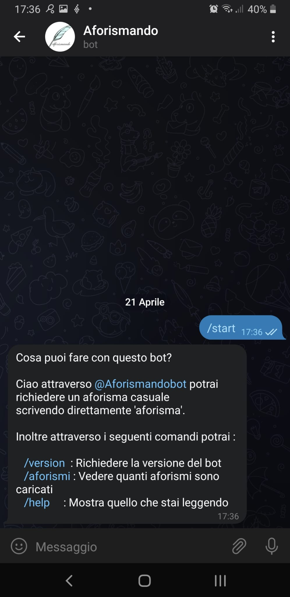

A Telegram Quote Bot Multilingual (English, Italian and Spanish). @Aforismandobot. It is my first bot.   
Actually is hosted on [glitch](https://glitch.com/~aforismando-telegram-bot).   

What can you do with this bot? 

| Command   | Language     | Description  
| :-------- | :------- | :-------- | 
| /version | en | Show server version in english |
| /versión | es | Show server version in spanish |
| /versione | it | Show server version in italian |
| /aiuto | it | Show an help in italian |
| /help | en | Show an help in english |
| /ayuda | es | Show an help in spanish |
| /quotes | en | Show how many quote are loaded in english |
| /aforismos | es | Show how many quote are loaded in spanish |
| /aforismi | it | Show how many quote are loaded in italian |
| quote | en | Show random quote in english |
| aforismo | es | Show random quote in spanish |
| aforisma | it | Show random quote in italian |

This bot use my other project [quotes_api](https://github.com/gpalleschi/quotes_api) hosted on [Vercel](https://quotes-api-three.vercel.app/api/).     

### Prerequisites  

* Node v16.13.1 or upper
* npm  v7.19.1 or upper

### Built With  
* [Visual Code Editor](https://code.visualstudio.com)  

### NPM Modules
npm install  

### Run
npm start

### Authors  

* **Giovanni Palleschi** - [gpalleschi](https://github.com/gpalleschi)  

### License

This project is licensed under the GNU GENERAL PUBLIC LICENSE 3.0 License - see the [LICENSE](LICENSE) file for details  
