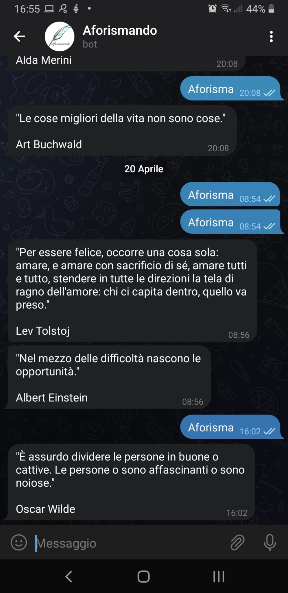

A Telegram Quote Bot. @Aforismandobot. It was my first bot.

### Prerequisites  

* Node v16.13.1 or upper
* npm  v7.19.1 or upper

### Built With  
* [Visual Code Editor](https://code.visualstudio.com)  

### NPM Modules
npm install  

### Run
npm start

### Authors  

* **Giovanni Palleschi** - [gpalleschi](https://github.com/gpalleschi)  

### License

This project is licensed under the GNU GENERAL PUBLIC LICENSE 3.0 License - see the [LICENSE](LICENSE) file for details  

